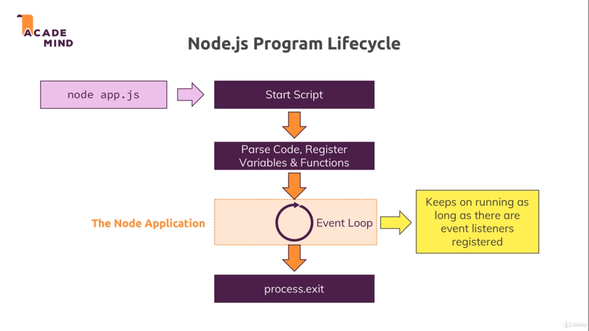

# 3. Understanding the basics

## Core Modules

1. http -> Launch a server , send request
2. https -> Launch a SSL server
3. fs
4. os

## Using http
```javascript
const http = require('http');
```
Here we omitted ```.js``` from ```http.js```.
And ommiting ```./``` from ```./http``` , node will not for any local file even there is ```http.js``` local file.

## Creating a server

``` javascript
const server = http.createServer((req, res) => {
    console.log(res);
});
server.listen(3000);
```
### Req and Res

There are two thing req and res. Request(req) is what wee send through url and response(res) is what we get as response.
Here we consoling the res -> which is a large set of information
But we are are not returning any web pages.

### Server.listen()

Its default port is 80. However we can set it to anything we want or according to need.
- Provides a simple method to create a server

## Event Loop and Exiting



``` javascript
const server = http.createServer((req, res) => {
    console.log(res);
    process.exit();
});
```

Response was still loged but this time node was no longer waiting for request.
``` process.exit() ``` -> hard exit the program

## Quitting the Running Node Server

` Ctrl + C ` Pressing this in terminal immidiately closes the node server.

## Understading requests

req has lot of methods attached but only few of them are acutally useful.
1. req.url
2. req.method
3. req.headers

For ` localhost:3000 `, url is `/` , method is ` GET ` and few headers are attached to them.

## Understanding Responses

We can set different types of header and also send some html files or code as a `response`

``` javascript
const server = http.createServer((req, res) => {
    res.setHeader('Content-Type', 'text/html');
    res.write(`
    <html>
        <head> <title> learning Node </title> </head>
        <body> Hey There!! I am learning NODEJS </body>
    </html>
    `);
    res.end();
    // nothing should responded after it ends i.e. res.end()
});
```

Inspecting this page on chrome , We can view headers , responses and some other details in the `network` tab.
